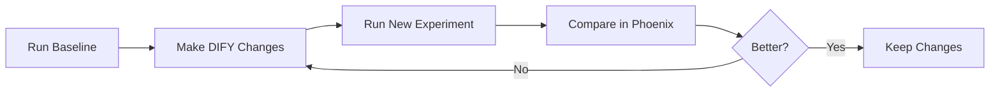

# Quick Start: DIFY Workflow Experiments

This guide will help you get started running experiments on your DIFY AI workflow to track quality improvements over time.

## What You'll Do

1. Set up your environment
2. Configure API access
3. Run a test experiment
4. View results in Phoenix
5. Iterate and improve your workflow

## Prerequisites

- ✅ DIFY workflow is running at `http://localhost`
- ✅ Phoenix is running at `http://localhost:6006`
- ✅ You have an existing dataset in Phoenix (e.g., "Good 2025-10-20T14:32:32.450Z")
- ✅ Python 3.11+ available

## Step 1: Set Up Environment

### Create Virtual Environment

```bash
cd /home/acb/venv-dirs/arize-phoenix/
python3.11 -m venv venv
source venv/bin/activate
```

### Install Dependencies

```bash
pip install \
    arize-phoenix-client \
    arize-phoenix-otel \
    openinference-instrumentation-openai \
    openai \
    httpx \
    pandas
```

## Step 2: Configure API Keys

### Get Your DIFY API Key

1. Open DIFY at `http://localhost`
2. Navigate to your chat workflow
3. Click **Settings** or **API Access**
4. Copy or create an API key (starts with `app-`)

### Get Your OpenAI API Key

Required for running LLM evaluators (Hallucination, Relevance, Q&A checks).

Get it from: https://platform.openai.com/api-keys

### Set Environment Variables

```bash
# Required
export DIFY_API_KEY="app-xxxxxxxxxxxxx"
export OPENAI_API_KEY="sk-xxxxxxxxxxxxx"

# Optional (these are defaults)
export DIFY_BASE_URL="http://localhost/v1"
export PHOENIX_BASE_URL="http://localhost:6006"
export EVAL_MODEL="gpt-4o"
```

**Pro tip:** Add these to your `~/.bashrc` or `~/.zshrc` so they persist.

## Step 3: Verify Your Dataset

Check that your dataset exists in Phoenix:

```bash
python -c "
from phoenix.client import Client
c = Client()
datasets = list(c.datasets.list_datasets())
for d in datasets:
    print(f'  - {d.name} ({len(d)} examples)')
"
```

You should see your dataset listed, e.g.:
```
  - Good 2025-10-20T14:32:32.450Z (15 examples)
```

## Step 4: Run Your First Experiment

### Option A: Quick Dry Run (Recommended First)

Test with just 3 examples to make sure everything works:

```bash
cd /home/acb/WSL2-Client-Work/InTheBox/phoenix

./scripts/experiments/run_experiment.sh --dry-run --verbose
```

This will:
- Run 3 prompts from your dataset through DIFY
- Execute all evaluators
- Show detailed logs
- **Not** log to Phoenix (dry run mode)

### Option B: Use the Shell Wrapper

```bash
./scripts/experiments/run_experiment.sh "baseline-v1"
```

### Option C: Use Python Script Directly

```bash
python scripts/experiments/run_dify_experiment.py \
    --dataset-name "Good 2025-10-20T14:32:32.450Z" \
    --experiment-name "baseline-v1"
```

## Step 5: View Results

Once the experiment completes, you'll see output like:

```
✓ Experiment completed successfully!
Experiment ID: abc123...
Experiment name: baseline-v1
View results: http://localhost:6006/datasets/xxx/compare?experimentId=abc123
```

### In Phoenix UI:

1. Go to `http://localhost:6006/datasets`
2. Click on your dataset
3. Click the **Experiments** tab
4. You'll see your experiment with all evaluator scores

### What You'll See:

**Code Evaluators** (instant results):
- ✓ `has_answer`: Did workflow return a response?
- ✓ `no_error`: Did API call succeed?
- ✓ `has_retrieval`: Were documents retrieved?
- ✓ `retrieval_count`: How many docs retrieved?

**LLM Evaluators** (quality assessment):
- 📊 `Hallucination`: Is the answer factual based on retrieved docs? (0-1)
- 📊 `Relevance`: Are retrieved docs relevant to the question? (0-1)
- 📊 `QA Correctness`: Is the answer correct? (0-1) *(optional, requires expected answers)*

## Step 6: Iterate and Improve

### Workflow for Improvement:



### Example Iteration:

1. **Baseline experiment:**
   ```bash
   ./scripts/experiments/run_experiment.sh "baseline"
   ```

2. **Make changes to DIFY:**
   - Adjust retrieval settings (top-k, score threshold)
   - Modify LLM prompts
   - Update knowledge base
   - Change model parameters

3. **Run new experiment:**
   ```bash
   ./scripts/experiments/run_experiment.sh "improved-retrieval-v2"
   ```

4. **Compare side-by-side in Phoenix UI:**
   - Which has better relevance scores?
   - Which has fewer hallucinations?
   - Which retrieves better documents?

5. **Keep what works, iterate on what doesn't!**

## Common Commands

### Run with Different Dataset

```bash
./scripts/experiments/run_experiment.sh \
    --dataset "my-other-dataset" \
    "experiment-name"
```

### Skip Q&A Evaluator (Faster)

```bash
./scripts/experiments/run_experiment.sh --skip-qa "test-run"
```

### Get Explanations from Evaluators

```bash
./scripts/experiments/run_experiment.sh --explain "detailed-test"
```

Note: This is slower and costs more (more tokens), but you get detailed explanations of why evaluators scored things certain ways.

### Verbose Logging for Debugging

```bash
./scripts/experiments/run_experiment.sh --verbose "debug-test"
```

## Troubleshooting

### "DIFY_API_KEY environment variable is not set"

```bash
export DIFY_API_KEY="app-xxxxx"
```

### "Dataset not found"

List available datasets:
```bash
python -c "from phoenix.client import Client; [print(d.name) for d in Client().datasets.list_datasets()]"
```

### "Connection refused"

Make sure Phoenix and DIFY are running:
```bash
# Check Phoenix
curl http://localhost:6006/healthz

# Check DIFY
curl http://localhost/health
```

### API Calls Timing Out

Increase timeout:
```bash
python scripts/experiments/run_dify_experiment.py \
    --dataset-name "Good 2025-10-20T14:32:32.450Z" \
    --timeout 120
```

### No Retrieved Documents in Results

- Verify your DIFY workflow has a knowledge retrieval node
- Check that the node is properly configured
- Test the workflow in DIFY UI first to ensure it's working

## Next Steps

- **Create More Datasets:** Capture diverse test cases from production traces
- **Add Custom Evaluators:** Create domain-specific quality checks
- **Automate Testing:** Run experiments on every DIFY workflow change
- **Track Trends:** Run weekly experiments to monitor quality over time

## Advanced Usage

See the full documentation:
- [Detailed README](../../scripts/experiments/README.md)
- [DIFY API Documentation](./dify-api.md)
- [Phoenix Experiments Docs](https://arize.com/docs/phoenix/datasets-and-experiments/)

## Need Help?

- Phoenix Docs: https://arize.com/docs/phoenix/
- Phoenix GitHub: https://github.com/Arize-ai/phoenix
- DIFY Docs: https://docs.dify.ai/

Happy experimenting! 🚀
