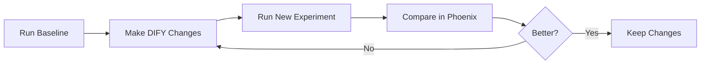

# Phoenix Experiments & Evals Guide

> **Audience:** Analysts and workflow owners who need to run experiments or review eval scores. For deployment / infrastructure steps, see `deployment.md`.

This guide explains how to run retrieval-quality evaluations for the Dify knowledge workflow using the custom tooling we added on the `gba-poc` branch. It covers everything from quick start setup to advanced dataset formats and continuous evaluation.

---

## Table of Contents

1. [Components We Maintain](#1-components-we-maintain)
2. [Quick Start](#2-quick-start)
3. [Dataset Expectations](#3-dataset-expectations)
4. [Running Experiments](#4-running-experiments)
5. [Continuous Trace Evals](#5-continuous-trace-evals)
6. [End-to-End Workflow](#6-end-to-end-workflow)
7. [Common Commands](#7-common-commands)
8. [Troubleshooting](#8-troubleshooting)
9. [FAQ & Tips](#9-faq--tips)
10. [Uploading Datasets](#10-uploading-datasets)
11. [Related References](#11-related-references)

---

## 1. Components We Maintain

- `scripts/experiments/run_dify_experiment.py` — core experiment runner that pulls a Phoenix dataset, calls the Dify workflow for every row, and logs evaluator scores back to Phoenix.
- `scripts/experiments/run_experiment.sh` — local convenience wrapper for the Python script.
- `scripts/experiments/run_experiment_docker.sh` + `docs/creative-planning/experiments-docker.md` — wrappers and docs for running the experiment inside the Docker Compose sidecar (`experiment-runner`).
- `scripts/evals/run_dify_rag_evals.py` — background eval runner that re-scores recent traces pulled directly from Phoenix (no new workflow calls).
- Supporting references: `scripts/experiments/DATASET_FORMATS.md`, `scripts/experiments/README.md`

Keep these pieces together when onboarding teammates; everything else in the OSS repo is upstream documentation.

---

## 2. Quick Start

This section will help you get started running experiments on your DIFY AI workflow to track quality improvements over time.

### What You'll Do

1. Set up your environment
2. Configure API access
3. Create or upload a dataset
4. Run a test experiment
5. View results in Phoenix
6. Iterate and improve your workflow

### Prerequisites

- ✅ DIFY workflow is running at `http://localhost`
- ✅ Phoenix is running at `http://localhost:6006`
- ✅ Python 3.11+ available

**Dataset Options (pick one):**
- **Option A:** You have traces in Phoenix that you'll use to create an input-only dataset, OR
- **Option B:** You have a CSV file with questions + expected answers ready to upload

### Step 1: Set Up Environment

#### Create Virtual Environment

```bash
cd /home/acb/venv-dirs/arize-phoenix/
python3.11 -m venv venv
source venv/bin/activate
```

#### Install Dependencies

```bash
pip install \
    arize-phoenix-client \
    arize-phoenix-otel \
    openinference-instrumentation-openai \
    openai \
    httpx \
    pandas
```

### Step 2: Configure API Keys

#### Get Your DIFY API Key

1. Open DIFY at `http://localhost`
2. Navigate to your chat workflow
3. Click **Settings** or **API Access**
4. Copy or create an API key (starts with `app-`)

#### Get Your OpenAI API Key

Required for running LLM evaluators (Hallucination, Relevance, Q&A checks).

Get it from: https://platform.openai.com/api-keys

#### Set Environment Variables

```bash
# Required
export DIFY_API_KEY="app-xxxxxxxxxxxxx"
export OPENAI_API_KEY="sk-xxxxxxxxxxxxx"

# Optional (these are defaults)
export DIFY_BASE_URL="http://localhost/v1"
export PHOENIX_BASE_URL="http://localhost:6006"
export EVAL_MODEL="gpt-4o"
```

Every Dify API key is scoped to a specific workflow. The experiment task runner simply calls whatever workflow the current `DIFY_API_KEY` grants access to. To target a different workflow, generate or copy the key for that workflow in Dify and update the `DIFY_API_KEY` value before you launch the experiment.

**Pro tip:** Add these to your `~/.bashrc` or `~/.zshrc` so they persist.

### Step 3: Create or Upload Your Dataset

You have two options for creating a dataset. Choose based on your needs:

---

**📋 Quick Decision Guide:**

| I have... | → Use this method | → Gets these evaluators |
|-----------|------------------|------------------------|
| Real user queries in Phoenix traces | Create from Traces (UI) | Hallucination + Relevance |
| CSV with questions + correct answers | Upload CSV | Hallucination + Relevance + Q&A |

---

#### Option A: Create Dataset from Traces (Input-Only)

If you have existing traces in Phoenix (from real usage or testing):

1. Open Phoenix UI: `http://localhost:6006`
2. Navigate to **Traces** in the left sidebar
3. Browse or filter traces to find interesting examples
4. Select trace rows by clicking the checkboxes
5. Click **"Add to Dataset"** button at the top
6. Choose **"Create new dataset"** or select an existing one
7. Give it a name (e.g., `User Questions 2025-10-28`)
8. Click **Save**

✅ **Result:** Input-only dataset ready for experiments!
⚠️ **Note:** No expected answers = Q&A evaluator will be skipped (you'll still get Hallucination + Relevance scores)

---

#### Option B: Upload CSV Dataset (Input + Gold Answers)

If you have curated questions with expected answers:

**1. Create CSV file:**
```csv
question,expected_answer
"What is the capital of France?","Paris"
"Who wrote Romeo and Juliet?","William Shakespeare"
```

**2. Upload to Phoenix:**
```bash
# Local Phoenix
./scripts/datasets/upload_dataset.sh my-dataset.csv "My QA Dataset v1"

# Remote Phoenix (EC2)
PHOENIX_BASE_URL="http://ec2-host:6006" \
PHOENIX_API_KEY="phx_..." \
  ./scripts/datasets/upload_dataset.sh my-dataset.csv
```

✅ **Result:** Full dataset with expected answers - runs ALL evaluators!

**See section [10. Creating and Uploading Datasets](#10-creating-and-uploading-datasets) for detailed instructions, troubleshooting, and advanced options.**

---

### Step 4: Verify Your Dataset

Check that your dataset exists in Phoenix:

```bash
python -c "
from phoenix.client import Client
c = Client()
datasets = list(c.datasets.list_datasets())
for d in datasets:
    print(f'  - {d.name} ({len(d)} examples)')
"
```

You should see your dataset listed, e.g.:
```
  - Good 2025-10-20T14:32:32.450Z (15 examples)
```

### Step 5: Run Your First Experiment

#### Option A: Launch from Phoenix UI (Run Experiment)

1. Open Phoenix (`http://localhost:6006`) and navigate to **Datasets** → select your dataset.
2. Click the **Run Experiment** button in the page header.
3. In the slide-over, choose the experiment script (we ship `run_dify_experiment` by default).
4. Optionally set an experiment name so it is easier to compare runs later.
5. Hit **Run**. You'll see a toast with the job ID and a **View Log** shortcut that streams the Python runner output.

The UI triggers the same backend command as the CLI options below. It uses the Dify workflow associated with your current `DIFY_API_KEY`, so update that variable (and restart Phoenix if it's already running) before running against a different workflow.

> **Tip:** You can reopen the log any time at `/v1/experiment-jobs/<jobId>/log` or check status via `/v1/experiment-jobs/<jobId>`.

#### Option B: Quick Dry Run (CLI)

Test with just 3 examples to make sure everything works:

```bash
cd /home/acb/WSL2-Client-Work/InTheBox/phoenix

./scripts/experiments/run_experiment.sh --dry-run --verbose
```

This will:
- Run 3 prompts from your dataset through Dify
- Execute all evaluators
- Show detailed logs
- **Not** log to Phoenix (dry run mode)

#### Option C: Use the Shell Wrapper

```bash
./scripts/experiments/run_experiment.sh "baseline-v1"
```

#### Option D: Use Python Script Directly

```bash
python scripts/experiments/run_dify_experiment.py \
    --dataset-name "Good 2025-10-20T14:32:32.450Z" \
    --experiment-name "baseline-v1"
```

### Step 6: View Results

Once the experiment completes, you'll see output like:

```
✓ Experiment completed successfully!
Experiment ID: abc123...
Experiment name: baseline-v1
View results: http://localhost:6006/datasets/xxx/compare?experimentId=abc123
```

#### In Phoenix UI:

1. Go to `http://localhost:6006/datasets`
2. Click on your dataset
3. Click the **Experiments** tab
4. You'll see your experiment with all evaluator scores

#### What You'll See:

**Code Evaluators** (instant results):
- ✓ `has_answer`: Did workflow return a response?
- ✓ `no_error`: Did API call succeed?
- ✓ `has_retrieval`: Were documents retrieved?
- ✓ `retrieval_count`: How many docs retrieved?

**LLM Evaluators** (quality assessment):
- 📊 `Hallucination`: Is the answer factual based on retrieved docs? (0-1)
- 📊 `Relevance`: Are retrieved docs relevant to the question? (0-1)
- 📊 `QA Correctness`: Is the answer correct? (0-1) *(optional, requires expected answers)*

---

## 3. Dataset Expectations

Before running experiments, you need a dataset in Phoenix. There are **two types** you can create, and `run_dify_experiment.py` works with both:

**Dataset Creation Summary:**

| Dataset Type | Creation Method | Has Expected Answers? | QA Evaluator? | Use Case |
|--------------|----------------|----------------------|---------------|----------|
| **Input-Only** | Phoenix UI (from traces) | ❌ No | Skipped | Quick testing, real user queries |
| **Input + Gold Answer** | CSV upload | ✅ Yes | Enabled | Comprehensive testing, regression suite |

Both types enable Hallucination and Relevance evaluators. The QA correctness evaluator only runs when you have expected answers.

### 3.1 Input-Only Datasets (pulled from traces)

Use this when you collect prompts via Phoenix tracing (e.g., select "Add to dataset" on trace rows). Those datasets usually contain only the user request and the original workflow answer.

- **Input column names supported:** `question`, `query`, `input`, or Phoenix trace exports' `sys.query`.
- **Expected/Output column:** not required. The script sees that `expected` is missing and automatically disables QA correctness.
- **Evaluators that run:** custom code checks (`has_answer`, `no_error`, `has_retrieval`, `retrieval_count`) plus LLM-based **relevance** and **hallucination**. `qa_correctness` short-circuits with the explanation "No expected answer..." so the experiment still succeeds.
- **Typical creation flow:** collect traces → select rows in Phoenix UI → "Add to dataset" → name it (e.g., `Good 2025-10-20T14:32:32.450Z`).

This format is perfect for quick regressions when you only care about retrieval quality and hallucination risk.

### 3.2 Input + Gold Answer Datasets (curated CSV upload)

Upload a CSV (or create via the Python client) when you have authoritative answers.

- **Input column names:** same as above.
- **Gold answer column names:** `expected_answer` (preferred), or `answer`, `expected`, `output`, or `reference` (our FAQ export uses this).
- **Evaluator coverage:** everything from the input-only case **plus** the LLM `qa_correctness` check, because `run_dify_experiment.py` finds the gold answer and feeds it to the Phoenix QA evaluator.
- **Import reminder:** make sure `input_keys=["question"]` and `output_keys=["expected_answer"]` (matching actual column names) when creating the dataset through the Phoenix UI or SDK. See examples in `scripts/experiments/DATASET_FORMATS.md`.

Use this format when you need an objective pass/fail on the workflow's final answer in addition to retrieval metrics.

---

## 4. Running Experiments

Experiments ask Dify to re-run the workflow, so you need valid API credentials and your Phoenix dataset name.

### 4.1 Environment Prerequisites

- `DIFY_API_KEY` — from the Dify app's API section (starts with `app-`).
- `DIFY_BASE_URL` — `http://localhost/v1` locally, or `http://host.docker.internal:7788` inside the Docker sidecar.
- `OPENAI_API_KEY` — used by the Phoenix LLM evaluators (`Hallucination`, `Relevance`, `QA`).
- `EVAL_MODEL` — judge model (default `gpt-4o`, overridable per run).
- Phoenix must be reachable (`PHOENIX_BASE_URL` defaults to `http://localhost:6006` outside Docker and `http://phoenix:6006` inside).

### 4.2 Phoenix UI "Run Experiment" Panel

- Open a dataset in Phoenix and click the **Run Experiment** button in the header.
- The slide-over shows every backend-allowed script returned by `/v1/experiment-scripts`. By default you'll see `run_dify_experiment`, which calls `scripts/experiments/run_dify_experiment.py`.
- Optionally set a friendly experiment name; otherwise Phoenix will generate one.
- Hit **Run** to queue the job. A toast confirms the job ID and links to the streaming log (`/v1/experiment-jobs/<jobId>/log`).
- Jobs run on the Phoenix server process, so keep that terminal open if you're developing locally. Results land in the dataset's **Experiments** tab when complete.

Remember that the Python runner uses the Dify workflow tied to `DIFY_API_KEY`. Swap the key (and restart the Phoenix server if the variable lives in its environment) when you need to exercise a different workflow.

### 4.3 Local CLI Wrapper (`run_experiment.sh`)

```bash
# Smoke test with three rows
./scripts/experiments/run_experiment.sh --dry-run

# Full run with a custom name
./scripts/experiments/run_experiment.sh "baseline-v1"

# Target a different dataset and skip QA (if you know it lacks gold answers)
./scripts/experiments/run_experiment.sh \
  --dataset "Good 2025-10-24T10:00:00.000Z" \
  --skip-qa \
  "retrieval-tuning-rc1"
```

The script validates `DIFY_API_KEY`, warns if `OPENAI_API_KEY` is missing, and then invokes `run_dify_experiment.py` with the right flags. Use `--dry-run N` to limit the row count, `--verbose` for debug logs, `--explain` for evaluator rationales.

### 4.4 Docker Sidecar (`run_experiment_docker.sh`)

When Phoenix runs via Docker Compose, trigger experiments with the helper script (see `experiments-docker.md` for full details):

```bash
# Ensure phoenix service is up
docker compose up -d phoenix

# Run experiment in the sidecar container
./scripts/experiments/run_experiment_docker.sh "baseline-v1"
```

The wrapper will:
1. Check Phoenix health.
2. Invoke `docker compose run --rm experiment-runner -m scripts.experiments.run_dify_experiment ...`.
3. Forward any options you supply (`--dry-run`, `--skip-qa`, `--explain`, `--dataset`, etc.).

Inside Docker we map `host.docker.internal` so the sidecar can contact a host‑running Dify instance. Adjust `DIFY_BASE_URL` accordingly.

### 4.5 Reading the Output

`run_dify_experiment.py` logs:
- Which dataset was used and how many examples were loaded.
- Any API errors from Dify per row.
- Evaluator counts (custom code + LLM judges).
- The Phoenix experiment ID and a UI link: `http://<phoenix>/datasets/<dataset_id>/compare?experimentId=<id>`.

Use the Phoenix UI **Experiments** tab to compare runs (baseline vs. new workflow version) across the relevance, hallucination, QA, and custom metrics we defined.

---

## 5. Continuous Trace Evals

Use this when you want to score live traffic without re-triggering the workflow.

- Runs in the `eval-runner` sidecar (see `deployment.md`).
- Pulls recent Phoenix traces (`SpanQuery`) for the configured project (`PHOENIX_PROJECT`, default `default`).
- Extracts the user question and retrieved documents from span payloads, normalizes the text, and hands them to Phoenix's Relevance, Hallucination, and optional QA evaluators.
- Flags:
  - `--since-minutes` — lookback window (overridden by `EVAL_WINDOW_MINUTES`).
  - `--loop` + `--interval-seconds` — continuous mode (used by the Docker service).
  - `--skip-qa`, `--explain`, `--dry-run`, `--verbose`.
- For local manual execution:

```bash
python -m scripts.evals.run_dify_rag_evals \
  --project default \
  --since-minutes 120 \
  --verbose \
  --dry-run
```

Because this path relies on existing traces, it naturally handles datasets that only have user inputs and generated answers; gold answers are optional here as well.

---

## 6. End-to-End Workflow

### Typical Iteration Process



### Detailed Steps

1. **Create or prepare a dataset**

   **Option A: Input-Only Dataset (from traces)**
   - Go to Phoenix UI → Traces
   - Select interesting trace rows (good answers, edge cases, failures)
   - Click "Add to Dataset"
   - Name your dataset
   - ✅ Quick to create, no expected answers needed
   - ✅ Gets Hallucination + Relevance scores
   - ❌ Skips Q&A correctness (no gold answers)

   **Option B: Input + Gold Answer Dataset (CSV upload)**
   - Create CSV with `question,expected_answer` columns
   - Upload with: `./scripts/datasets/upload_dataset.sh my-data.csv`
   - ✅ Gets all evaluators (Hallucination + Relevance + Q&A)
   - ✅ Comprehensive quality testing
   - ❌ Requires manual curation of correct answers

2. **Run baseline experiment**
   - `./scripts/experiments/run_experiment.sh "baseline"` or the Docker wrapper.
   - Confirm scores appear in Phoenix UI.

3. **Iterate on the Dify workflow**
   - Adjust retrieval settings (top-k, score threshold)
   - Modify LLM prompts
   - Update knowledge base
   - Change model parameters

4. **Re-run experiment with a new name**
   - Compare runs in Phoenix. Look for improvements on relevance, hallucination, and QA (if applicable).

5. **Monitor live traffic**
   - Keep `eval-runner` running via Docker Compose to score traces continuously and spot regressions quickly.

6. **Need it on EC2?**
   - Hand off to the platform team with a link to `deployment.md`; they manage container builds, env files, and remote script copies.

---

## 7. Common Commands

### Run with Different Dataset

```bash
./scripts/experiments/run_experiment.sh \
    --dataset "my-other-dataset" \
    "experiment-name"
```

### Skip Q&A Evaluator (Faster)

```bash
./scripts/experiments/run_experiment.sh --skip-qa "test-run"
```

### Get Explanations from Evaluators

```bash
./scripts/experiments/run_experiment.sh --explain "detailed-test"
```

Note: This is slower and costs more (more tokens), but you get detailed explanations of why evaluators scored things certain ways.

### Verbose Logging for Debugging

```bash
./scripts/experiments/run_experiment.sh --verbose "debug-test"
```

### List Available Datasets

```bash
python -c "from phoenix.client import Client; [print(d.name) for d in Client().datasets.list_datasets()]"
```

### Custom Timeout for Slow Workflows

```bash
python scripts/experiments/run_dify_experiment.py \
    --dataset-name "Good 2025-10-20T14:32:32.450Z" \
    --timeout 120
```

---

## 8. Troubleshooting

### "DIFY_API_KEY environment variable is not set"

```bash
export DIFY_API_KEY="app-xxxxx"
```

### "Dataset not found"

List available datasets:
```bash
python -c "from phoenix.client import Client; [print(d.name) for d in Client().datasets.list_datasets()]"
```

Make sure you're using the exact name (case-sensitive).

### "Connection refused" to Phoenix

Make sure Phoenix is running:
```bash
# Check Phoenix
curl http://localhost:6006/healthz

# Or check docker service
docker compose ps phoenix
docker compose logs phoenix
```

### "Connection refused" to DIFY

Make sure DIFY is running:
```bash
# Check DIFY
curl http://localhost/health
```

### API Calls Timing Out

Increase timeout:
```bash
python scripts/experiments/run_dify_experiment.py \
    --dataset-name "Good 2025-10-20T14:32:32.450Z" \
    --timeout 120
```

### No Retrieved Documents in Results

- Verify your DIFY workflow has a knowledge retrieval node
- Check that the node is properly configured
- Test the workflow in DIFY UI first to ensure it's working

### Python Module Import Errors

**Problem:** Can't find `scripts.experiments.run_dify_experiment`

**Check:** Ensure you're running from the repository root and using Python module syntax:

```bash
# ✅ Correct (from repo root)
python -m scripts.experiments.run_dify_experiment

# ❌ Wrong
python scripts/experiments/run_dify_experiment.py
```

---

## 9. FAQ & Tips

### Why do experiments work with trace-derived datasets?

`run_dify_experiment.py` looks for multiple field aliases (`question`, `query`, `input`, `sys.query`) so Phoenix exports from traces plug in directly. Missing gold answers only disables `qa_correctness`; all other evaluators still run.

### How are retrieved documents passed to evaluators?

The Dify API response contains `metadata.retriever_resources`. The task runner flattens that list into a newline separated string (`reference`). Hallucination and relevance evaluators consume that string as contextual evidence.

### What happens if Dify errors?

The task runner records the error message and sets `output=""`. The `no_error` evaluator fails, while LLM evaluators return zero with explanatory text so the experiment makes the failure visible.

### Can I change the judge model?

Yes. Set `EVAL_MODEL` or pass `--eval-model` when calling the script/wrapper. Any OpenAI-compatible model supported by Phoenix (e.g., `gpt-4o-mini`) will work, as long as the API key has access.

### Where to look for log files?

In verbose Docker runs, `run_experiment_docker.sh` prints container logs directly. For the eval sidecar, use `docker compose logs eval-runner`. If you pass `--log-dir` to `run_dify_rag_evals.py`, it writes detailed logs and DataFrames under that directory.

### Best Practices

1. **Start with dry runs**: Always test with `--dry-run 3` first
2. **Use descriptive names**: Name experiments clearly: `improved-retrieval-v2`, not `test1`
3. **Track changes**: Document what changed between experiments
4. **Baseline first**: Run a baseline before making DIFY changes
5. **Compare in Phoenix**: Always view results in UI to spot patterns
6. **Skip Q&A when iterating**: Use `--skip-qa` for faster iteration, full eval for final tests

### Performance & Cost Considerations

**Typical experiment with 15 examples:**
- **Code evaluators**: Instant (< 1 second)
- **LLM evaluators**: ~2-5 seconds per example
- **Total time**: 1-2 minutes for 15 examples

**With `--explain` flag:**
- **Total time**: 3-5 minutes for 15 examples (more API calls)

**Cost using GPT-4o as evaluator (default):**
- ~500-1000 tokens per evaluation
- 3 LLM evals per example (Hallucination, Relevance, Q&A)
- 15 examples = ~45 API calls
- **Estimated cost**: $0.10-0.30 per experiment run

Use `--skip-qa` to reduce to 2 evals per example and cut costs by ~33%.

---

## 10. Creating and Uploading Datasets

Before running experiments, you need a dataset in Phoenix. Choose the method that fits your needs:

### Which Dataset Creation Method Should I Use?

**Use Input-Only Datasets (from traces)** when:
- ✅ You have real user queries captured in Phoenix traces
- ✅ You want to test quickly without curating expected answers
- ✅ You only care about retrieval quality and hallucination detection
- ✅ You're doing exploratory testing or regression checks

**Use Input + Gold Answer Datasets (CSV upload)** when:
- ✅ You have authoritative/correct answers for your questions
- ✅ You need comprehensive quality evaluation including Q&A correctness
- ✅ You're building a regression test suite
- ✅ You want to measure answer quality improvements over time

---

### Creating Input-Only Datasets from Traces (Phoenix UI)

This is the quickest way to create a dataset from real user interactions:

1. Open Phoenix UI: `http://localhost:6006`
2. Navigate to **Traces** in the left sidebar
3. Browse or filter to find interesting examples:
   - Good responses you want to preserve
   - Edge cases that are challenging
   - Failed queries that need investigation
4. Select trace rows using checkboxes
5. Click **"Add to Dataset"** button at the top of the page
6. Choose **"Create new dataset"** or add to existing
7. Give it a descriptive name (e.g., `User Questions 2025-10-28`)
8. Click **Save**

**Result:** Input-only dataset ready for experiments. Will run Hallucination and Relevance evaluators (Q&A skipped automatically).

---

### Uploading Input + Gold Answer Datasets (CSV)

If you have curated questions with expected answers, upload them as CSV:

#### Quick Upload

```bash
# Upload to local Phoenix
./scripts/datasets/upload_dataset.sh my-dataset.csv "My QA Dataset v1"

# Upload to remote Phoenix (EC2)
PHOENIX_BASE_URL="http://ec2-host:6006" \
PHOENIX_API_KEY="phx_..." \
  ./scripts/datasets/upload_dataset.sh my-dataset.csv
```

#### Expected CSV Format

Create a CSV file with at least two columns: questions and expected answers.

```csv
question,expected_answer
"What is the capital of France?","Paris"
"Who wrote Romeo and Juliet?","William Shakespeare"
"What is photosynthesis?","The process by which plants convert light energy into chemical energy"
```

**Supported column names:**
- **Questions:** `question` (recommended), `query`, `input`
- **Expected answers:** `expected_answer` (recommended), `answer`, `expected`, `output`, `reference`

#### Upload Methods

**Method 1: Shell Wrapper (Easiest)**

```bash
./scripts/datasets/upload_dataset.sh my-data.csv "Dataset Name"
```

**Method 2: Python Script (More Control)**

```bash
python scripts/datasets/upload_dataset.py my-data.csv \
    --name "custom-name" \
    --phoenix-url "http://localhost:6006" \
    --input-keys "question" \
    --output-keys "expected_answer"
```

**Method 3: Interactive Python (Most Flexible)**

```python
import pandas as pd
from phoenix.client import Client

client = Client(base_url="http://localhost:6006", api_key="your-key")
df = pd.read_csv("my-data.csv")

dataset = client.datasets.create_dataset(
    name="my-dataset",
    dataframe=df,
    input_keys=["question"],
    output_keys=["expected_answer"],
)
```

#### For Remote Phoenix (EC2)

**Option A: Upload from your local machine**

```bash
# Get Phoenix API key from Phoenix UI (Settings → API Keys)
export PHOENIX_BASE_URL="http://your-ec2-host:6006"
export PHOENIX_API_KEY="phx_..."

./scripts/datasets/upload_dataset.sh my-data.csv
```

**Option B: Copy CSV to EC2 and upload there**

```bash
# Copy CSV to EC2
scp my-dataset.csv ubuntu@ec2-host:/tmp/

# SSH and upload
ssh ubuntu@ec2-host
cd /opt/phoenix
./scripts/datasets/upload_dataset.sh /tmp/my-dataset.csv
```

---

### Comparison: Which Method to Choose?

| Feature | Input-Only (Traces) | Input + Gold Answer (CSV) |
|---------|---------------------|---------------------------|
| **Creation speed** | ⚡ Very fast | ⏱️ Requires CSV preparation |
| **Data source** | Real user interactions | Curated test cases |
| **Expected answers** | ❌ Not included | ✅ Required |
| **Evaluators enabled** | Hallucination, Relevance | Hallucination, Relevance, Q&A |
| **Best for** | Quick testing, exploration | Comprehensive regression testing |
| **Setup effort** | Minimal (just select traces) | Moderate (create/curate CSV) |

---

### Detailed Documentation

For complete upload instructions, troubleshooting, and advanced usage, see:
- **`scripts/datasets/README.md`** - Complete upload tool documentation
- **`scripts/experiments/DATASET_FORMATS.md`** - Dataset format specifications

---

## 11. Related References

- **Dataset upload tools** — `scripts/datasets/README.md`
- Dataset examples and evaluator matrix — `scripts/experiments/DATASET_FORMATS.md`
- Full experiment README — `scripts/experiments/README.md`
- Docker-specific instructions — `experiments-docker.md`
- Deployment playbook — `deployment.md`
- DIFY API reference — `dify-api-reference.md`
- Phoenix upstream docs: https://arize.com/docs/phoenix/
- Phoenix experiments docs: https://arize.com/docs/phoenix/datasets-and-experiments/
- Phoenix GitHub: https://github.com/Arize-ai/phoenix
- DIFY Docs: https://docs.dify.ai/

---

## Next Steps

- **Create More Datasets:** Capture diverse test cases from production traces
- **Add Custom Evaluators:** Create domain-specific quality checks
- **Automate Testing:** Run experiments on every DIFY workflow change
- **Track Trends:** Run weekly experiments to monitor quality over time

Happy experimenting! 🚀
